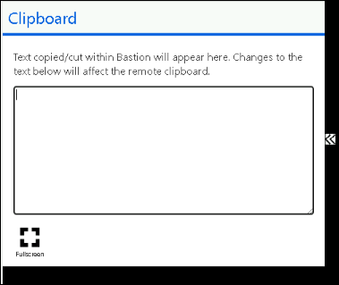

# Building a Resilient IaaS Architecture
### Overall Estimated Duration: 6 Hours

## Overview
Building a Resilient IaaS Architecture lab focuses on improving the reliability of the Contoso application by implementing Azure solutions for high availability, disaster recovery (DR), and data protection. High availability is achieved by adding redundancy across the web, database, and domain controller tiers. A secondary Disaster Recovery site is then configured using appropriate Azure technologies for each tier to ensure business continuity. Azure Backup is employed to safeguard the web tier virtual machines and the SQL Server database. Finally, the lab concludes by validating the high availability, Disaster Recovery, and backup configurations to ensure the application’s resiliency and preparedness for potential failures.

## Objective
The goal of this lab is to improve the reliability of the Contoso application by implementing high availability, disaster recovery (DR), and backup solutions in Azure. By the end of this lab, participants will be able to:

- **High Availability Configuration:** Learn to deploy additional web, database, and domain controller VMs for the Contoso application. This exercise will guide you in configuring redundancy across each tier to create a high-availability architecture, ensuring continuous service availability.
- **Disaster Recovery Setup:** Learn to set up a secondary disaster recovery site to support all tiers of the Contoso application. This site will use different technologies for each tier to ensure seamless disaster recovery and business continuity.
- **Backup Implementation:** Learn to use Azure Backup to configure backup solutions for the Contoso application. This exercise will cover backup setup for both the web tier VMs and the SQL Server database to secure critical data.
- **Resiliency Validation:** Learn to validate the high availability, disaster recovery, and backup solutions implemented in the earlier exercises. This final step will ensure that the system is resilient and prepared for any disruptions.

## Prerequisites

Participants should have a basic understanding of the following:

- **Azure Site Recovery:** Understanding of Azure Site Recovery concepts and operations.
- **SQL Server Management:** Understanding of SQL Server concepts and operations.
- **Networking Basics:** Familiarity with creating SMB shares and managing network configurations.
- **Azure Front Door:** Knowledge of Azure Front Door architecture, features, and operations.

## Architecture
In this high availability and disaster recovery architecture, **Azure resources** are deployed to configure **High Availability (HA)** for the **Domain Controller**, **SQL Server**, and **Web tiers**, ensuring resilience and fault tolerance. **Disaster Recovery (DR)** resources, such as **Azure Site Recovery**, are implemented to enable failover capabilities, while a public endpoint is configured using **Azure Front Door** for global accessibility. Additionally, **Azure Backup** resources are set up to protect data for the **Web tier** and **SQL Server tier**. Advanced tasks include validating HA configurations, performing region-to-region disaster recovery failback for **IaaS**, and verifying the integrity of **VM backups** and **SQL backups**, ensuring operational continuity and robust recovery mechanisms.

## Architecture Diagram

## Explanation of Components
The architecture for this lab involves the following key components:

- **Azure Front Door:** A scalable and secure entry point for delivering global applications, providing features like load balancing, content delivery, SSL offloading, and application acceleration to optimize performance and ensure high availability.
- **Azure Site Recovery:** A disaster recovery service that enables the replication, failover, and recovery of applications and workloads to Azure, ensuring business continuity in the event of a site failure. It supports a variety of environments, including VMware, Hyper-V, and physical servers.
- **Azure Load Balancer:** A high-performance, scalable service that distributes incoming traffic across multiple virtual machines (VMs) to ensure high availability and reliability of applications.
- **Backend Pools:** A collection of resources, typically virtual machines or application gateway servers, that receive and handle traffic from a load balancer or application gateway. In Azure, backend pools are used to distribute network traffic across multiple servers to ensure high availability and scalability.
- **SQL Server Management Studio (SSMS):** A comprehensive tool for managing SQL Server instances, enabling database administration, query execution, and performance monitoring in a user-friendly interface.

## Getting Started with Your Building a Resilient IaaS Architecture Hands On Lab
Welcome to your Building a Resilient IaaS Architecture Hands On Lab! We've prepared a seamless environment for you to explore and learn about Azure services. Let's begin by making the most of this experience:

## Accessing Your Lab Environment
 
Once you're ready to dive in, your virtual machine and **Lab Guide** will be right at your fingertips within your web browser.
 

## Virtual Machine & Lab Guide
 
Your virtual machine is your workhorse throughout the workshop. The lab guide is your roadmap to success.
 
## Exploring Your Lab Resources
 
To get a better understanding of your lab resources and credentials, navigate to the **Environment** tab.
 

 
## Utilizing the Split Window Feature
 
For convenience, you can open the lab guide in a separate window by selecting the **Split Window** icon at the top right corner.

 
## Managing Your Virtual Machine
 
Feel free to start, stop, or restart your virtual machine as needed from the **Resources** tab. Your experience is in your hands!
 

 
## Let's Get Started with Azure Portal
 
1. On your virtual machine, click on the Azure Portal icon as shown below:
 
        

1. You'll see the **Sign into Microsoft Azure** tab. Here, enter your credentials:
 
   - **Email/Username:** <inject key="AzureAdUserEmail"></inject>
 
    
 
1. Next, provide your password:
 
   - **Password:** <inject key="AzureAdUserPassword"></inject>
 
    

1. If you see the pop-up **Action Required**, keep default and then click on **Ask later**. If you see the pop-up Help us protect your account, click on **Skip for now**(14 days until this is required), and then click on **Next**.

    

   >**NOTE:** Do not enable MFA, select **Ask Later**.
 
1. If prompted to stay signed in, you can click **No**.

    
 
1. If a **Welcome to Microsoft Azure** pop-up window appears, simply click **Maybe Later** to skip the tour.
   
1. Please note that for all exercises, we will be logging into the virtual machines via Bastion. To use the copy-paste functionality, click the arrow to copy the content to your clipboard, and then paste it as needed.

   

   

## Support Contact
The CloudLabs support team is available 24/7, 365 days a year, via email and live chat to ensure seamless assistance at any time. We offer dedicated support channels tailored specifically for both learners and instructors, ensuring that all your needs are promptly and efficiently addressed.

Learner Support Contacts:

   - Email Support: cloudlabs-support@spektrasystems.com
   - Live Chat Support: https://cloudlabs.ai/labs-support
   
Now you're all set to explore the powerful world of technology. Feel free to reach out if you have any questions along the way. Enjoy your workshop! 

Now, click on **Next** from the lower right corner to move to the next page.

   

### Happy Learning!!
