# Exercise 4: Validate resiliency

### Estimated Duration: 150 minutes

In this exercise, you will validate the high availability, disaster recovery, and backup solutions you have implemented in the earlier lab exercises.

### Objectives
In this exercise, you will complete the following tasks:
   - Task 1: Validate High Availability.
   - Task 2: Validate Disaster Recovery - Failover IaaS region to region.
   - Task 3: Validate Disaster Recovery - Failback region to IaaS region.
   - Task 4: Validate VM Backup.
   - Task 5: Validate SQL Backup.

### Task 1: Validate High Availability

In this task we will validate high availability for both the Web and SQL tiers.

1.  In the Azure portal, open the **ContosoRG1** resource group. Select the public IP address for the web tier load-balancer, **ContosoWebLBPrimaryIP**. Select the **Overview** tab and copy the DNS name to the clipboard, and navigate to it in a different browser tab.

1.  The Contoso application is shown. Select **Current Policy Offerings** to view the policy list - this shows the database is accessible. As an additional check, edit an existing policy and save your changes, to show that the database is writable.

1.  Open an Azure Bastion session with **SQLVM1** (with username `demouser@contoso.com` and password `Demo!pass123`). Open **SQL Server Management Studio** and connect to **SQLVM1** using Windows Authentication. Locate the BCDRAOG (Primary) availability group, right-click and select **Show Dashboard**. Note that the dashboard shows **SQLVM1** as the primary replica.

    

1.  Using the Azure portal, stop both **WebVM1** and **SQLVM1**. Wait a minute for the VMs to stop.

1.  Refresh the blade with the Contoso application. The application still works. Confirm again that the database is writable by changing one of the policies.

1.  Open an Azure Bastion session with **SQLVM2** (with username `demouser@contoso.com` and password `Demo!pass123`). Open **SQL Server Management Studio** and connect to **SQLVM2** using Windows Authentication. Locate the BCDRAOG (Primary)availability group, right-click and select **Show Dashboard**. Note that the dashboard shows **SQLVM2** as the primary replica, and there is a critical warning about **SQLVM1** not being available.

    

1.  Restart **WebVM1** and **SQLVM1**. **Wait a full two minutes** for the VMs to start - **this is important**, we don't want to test simultaneous failover of SQLVM1 and SQLVM2 at this stage. Then stop **WebVM2** and **SQLVM2**.

1.  Refresh the blade with the Contoso application. The application still works. Confirm again that the database is writable by changing one of the policies.

1.  Re-open an Azure Bastion session with **SQLVM1** (with username `demouser@contoso.com` and password `Demo!pass123`). Open **SQL Server Management Studio** and connect to **SQLVM1** using Windows Authentication. Locate the BCDRAOG availability group, right-click and select **Show Dashboard**. Note that the dashboard shows **SQLVM1** as the primary replica, and there is a critical warning about **SQLVM2** not being available.

    

1. Re-start **SQLVM2** and **WebVM2**.

### Task 2: Validate Disaster Recovery - Failover IaaS region to region

In this task, you will validate failover of the Contoso application from Primary region to Secondary region. The failover is orchestrated by Azure Site Recovery using the recovery plan you configured earlier. It includes failover of both the web tier (creating new Web VMs from the replicated data) and SQL Server tier (failure to the SQLVM3 asynchronous replica). The failover process is fully automated, with custom steps implemented using Azure Automation runbooks triggered by the Recovery Plan.

1. Using the Azure portal, open the **ContosoRG1** resource group. Navigate to the Front Door resource, locate the Frontend Host URL, and open it in a new browser tab. Navigate to it to ensure that the application is up and running from the Primary Site.

    

    Keep this browser tab open, as you will return to it later in the lab.

1. From a new browser tab, open the Azure portal, then navigate to the **BCDRRSV<inject key="DeploymentID" enableCopy="false"/>** Recovery Services Vault located in the **ContosoRG2** resource group.

1. Select **Recovery Plans (Site Recovery)** in the **Manage** area, then select **BCDRIaaSPlan**.

    

1. Select **Failover**.

    

1. Navigate back to the Failover page, select **I understand the risk, Skip test failover**.

    

1. Review the Failover direction. Notice that **From** is the **Primary** site, and **To** is the **Secondary** site. Select **OK**.

    

   >**Note:** If you encounter an error, then follow steps 7 and 8.

1. If you face an error while performing the Failover, go to **Replicated items** under Protected items, select **WebVM1**, and then click on **Cleanup test failover**.

      
      
1. On the Test failover cleanup page, enter notes as **Test Cleanup**, select the check box, and click on **OK**.

      
      
1. Perform the same steps as in steps 7 and 8 for **WebVM2**.

1. Navigate back to the Failover page, select **I understand the risk, Skip test failover**.

    

1. Review the Failover direction. Notice that **From** is the **Primary** site, and **To** is the **Secondary** site. Select **OK**.

    

1. After the Failover is initiated, close the Failover blade and navigate to **Site Recovery Jobs**. Select the **Failover** job to monitor the progress.

    

1. You can monitor the progress of the Failover from this panel.

    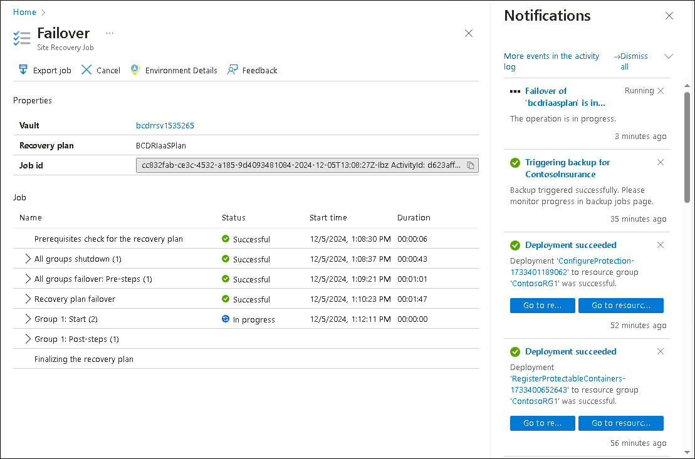

    > **Note:** Do not make any changes to your VMs in the Azure portal during this process. Allow ASR to take the actions and wait for the failover notification before moving on to the next step. You can open another portal view in a new browser tab and review the output of the Azure Automation Jobs, by opening the jobs and selecting Output.

1. Once the Failover job has finished, it should show as *Successful* for all tasks. This may take more than 15 minutes.

    

1. Select **Resource groups** and select **ContosoRG1**. Open **WebVM1** and notice that it currently shows as **Status: Stopped (deallocated).** This shows that failover automation has stopped the VMs at the **Primary** site.

    

    > **Note:** Do not select Start! The VM will be restarted automatically by ASR during failback.

1. Move back to the Resource group **ContosoRG1** and select the **ContosoWebLBPrimaryIP** Public IP address. Copy the DNS name and paste it into a new browser tab. The website will be unreachable at the Primary location, since the Web VMs at this location have been stopped by ASR during failover.

1. In the Azure portal, move to the **ContosoRG2** resource group. Locate **WebVM1** in the resource group and select it to open. Notice that **WebVM1** is running in the **Secondary** site.

    

1. Move back to the **ContosoRG2** resource group and select the **ContosoWebLBSecondaryIP** Public IP address. Copy the DNS name and paste it into a new browser tab. The Contoso application is now responding from the **Secondary** site. Make sure to select the current Policy Offerings to ensure connectivity to the SQL Always-On group that was also failed over in the background.

1. Go back to the browser tab with the Contoso application open at the Front Door URL and refresh the page. The site should load quickly from the DR site. Users accessing the service via Front Door are automatically routed to the active site, ensuring seamless access despite the failover. While there may be some downtime during the failover process, once the site is back online, the user experience will remain the same as when it was running on the **Primary** site. If the page does not load immediately, wait for a few moments and try refreshing again.

    

    > **Note**: If you donot see the webpage after 5 minutes, Follow Step 20 to Step 23
    
1. If the webpage is responding from the **Secondary** site, go to **ContosoWebLBSecondary** load balancer (1) and navigate to **Backend pools** (2) and select **Backend pools(1)** (3)

    

1. Under **Backend Pool(1)** pane select **Vnet2**(1) for Virtual Network and click on **Add**(2).

    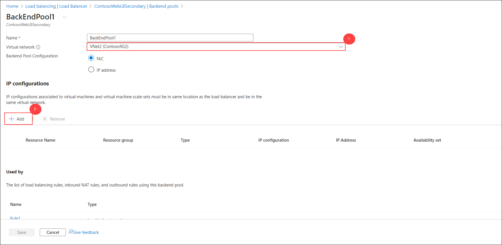

1. Under **Add IP configurations to backend pool** pane select **WebVM1** and **WebVM2** and click on **Add**.

    

1. You can now perform the Step 18 and Step 19 again.

1. Now that you have successfully tested failover, you need to configure ASR for failback. Move back to the **BCDRSRV** Recovery Service Vault using the Azure portal. Expand **Manage (1)** and select **Recovery Plans (Site Recovery) (2)** on the ASR dashboard. The **BCDRIaaSPlan** will show as **Failover completed (3).** 

    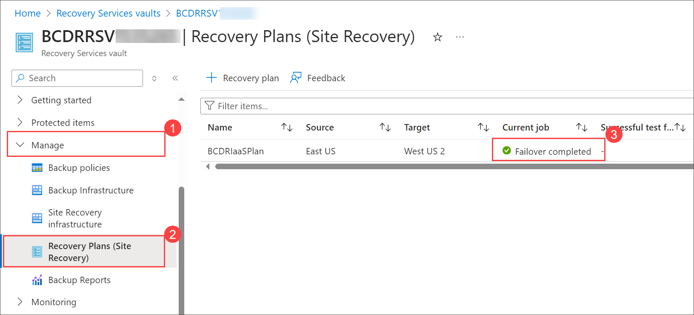

1. Select the **BCDRIaaSPlan**. Notice that now two (2) VMs are shown in the **Target** tile.

    

   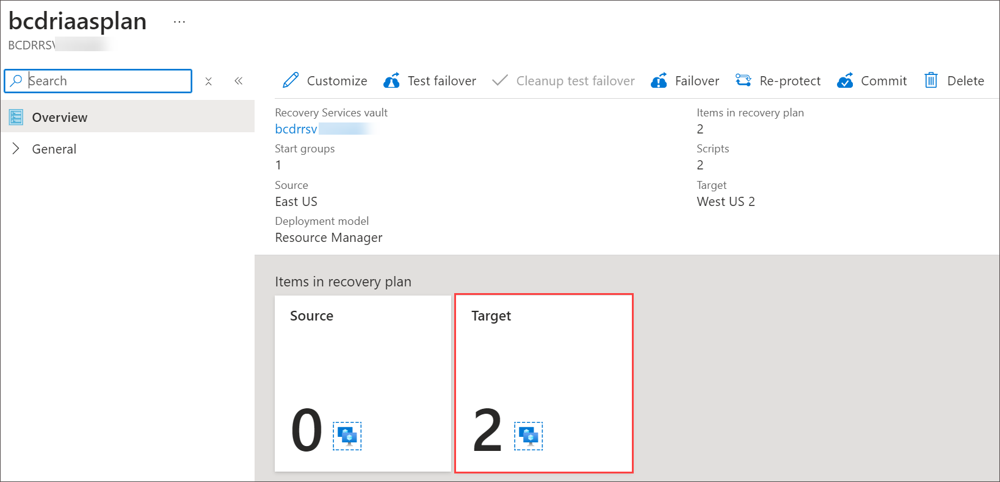

1. Select **Re-protect**.

    

1. On the **Re-protect** screen, review the configuration and then select **OK**.

    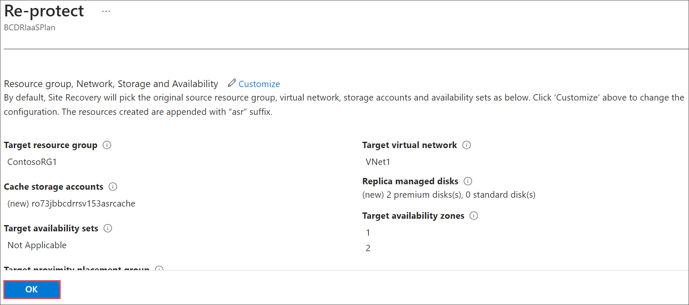

1. The portal will submit a deployment. This process will take up to 30 minutes to commit the failover and then synchronize WebVM1 and WebVM2 with the Recovery Services Vault. Once this process is complete, you will be able to failback to the primary site.

    > **Note:** You need to wait for the re-protect process to complete before continuing with the failback. You can check the status of the Re-protect. In left navigation pane of BCDRSRV expand **Monitoring** and select **Site Recovery jobs**.
    
    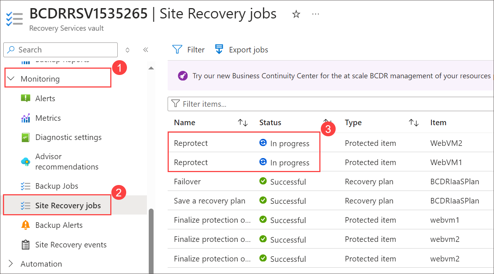
    
1. Once the jobs are completed, move to the **Replicated items** blade and wait for the **Status** to show as **Protected**. This status shows that the data synchronization is complete and the Web VMs are ready to failback.
    
    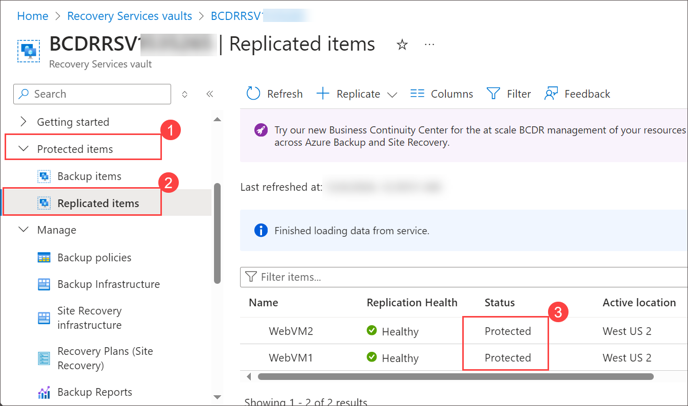

### Task 3: Validate Disaster Recovery - Failback region to IaaS region

In this task, you will failback the Contoso application from the DR site in Secondary Site back to the Primary site.

1.  Back on **BCDRRSV<inject key="DeploymentID" enableCopy="false"/>** Recovery Services vault, select **Recovery Plans** and re-open the **BCDRIaaSPlan**. Notice that the VMs are still at the Target since they are failed over to the secondary site.

     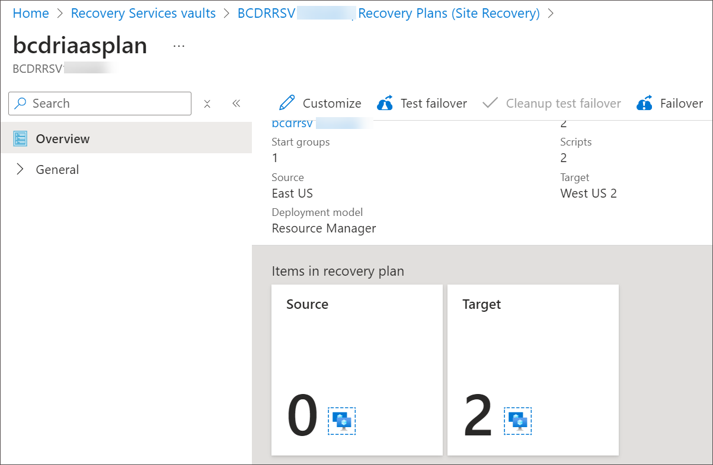

1.  Select **Failover**. At the warning about No Test Failover, select **I understand the risk, Skip test failover**. Notice that **From** is the **Secondary** site and **To** is the **Primary** site. Select **OK**.

    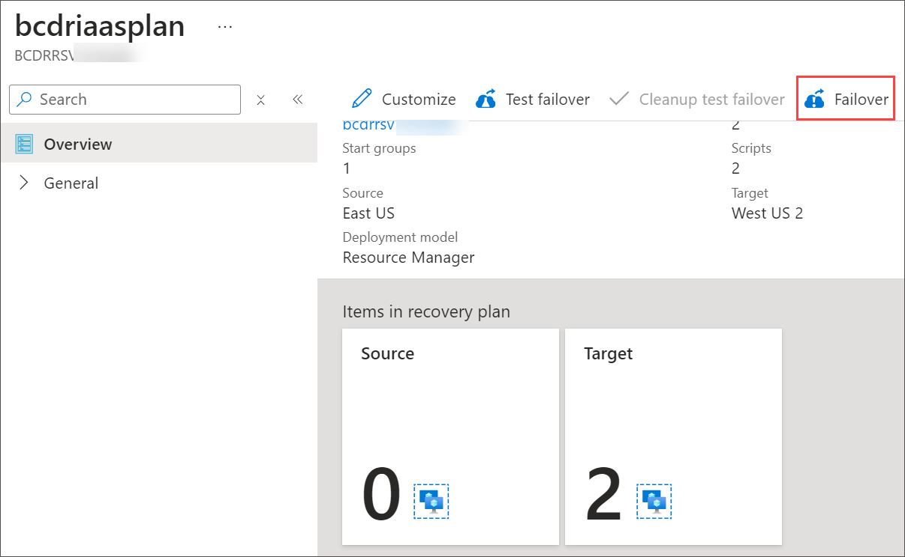 

    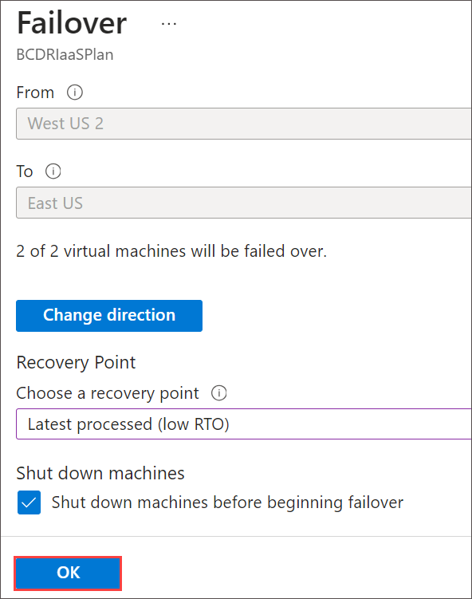

1.  After the Failover is initiated close the blade and select **Site Recovery Jobs** under **Monitoring** section, then select the **Failover** job to monitor the progress. Once the job has finished, it should show as successful for all tasks.

    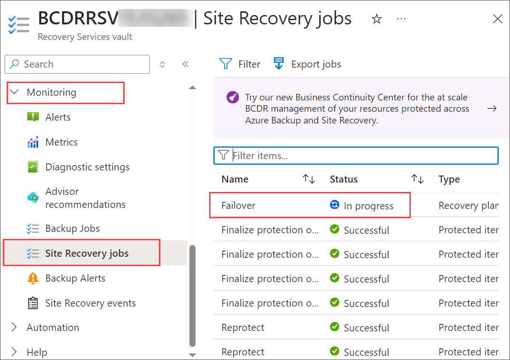

    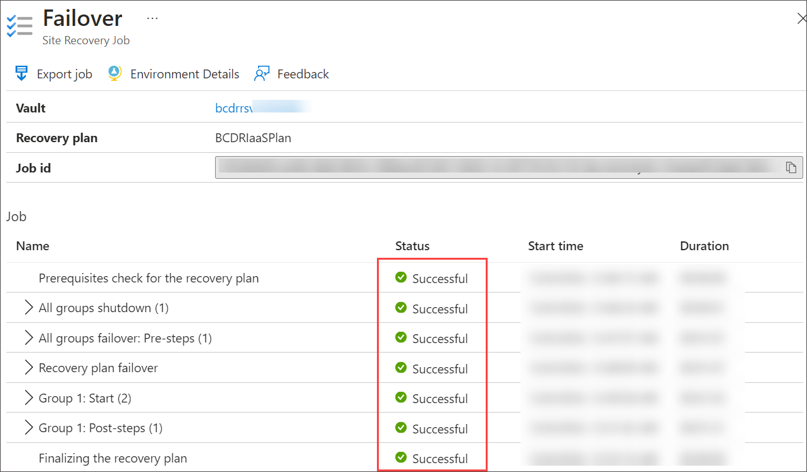

1.  Confirm that the Contoso application is once again accessible via the **ContosoWebLBPrimaryIP** public IP address, and is **not** available at the **ContosoWebLBSecondaryIP** address. This test shows it has been returned to the primary site. Open the **Current Policy Offerings** and edit a policy, to confirm database access. 

    > **Note:** If you get a "Our services aren't available right now" error (or a 404-type error) accessing the web application, verify that you are utilizing the **ContosoWebLBPrimaryIP**.  If it does not come up within ~10 minutes, verify that the backend system is responding.

1.  Confirm also that the Contoso application is also available via the Front Door URL.

1.  Now, that you have successfully failed back, you need to prep ASR for the Failover again. Move back to the **BCDRSRV** Recovery Service Vault using the Azure portal. Select Recovery Plans and open the **BCDRIaaSPlan**.

1.  Notice that now 2 VMs are shown in the **Source**. Select **Re-protect**, review the configuration and select **OK**.

    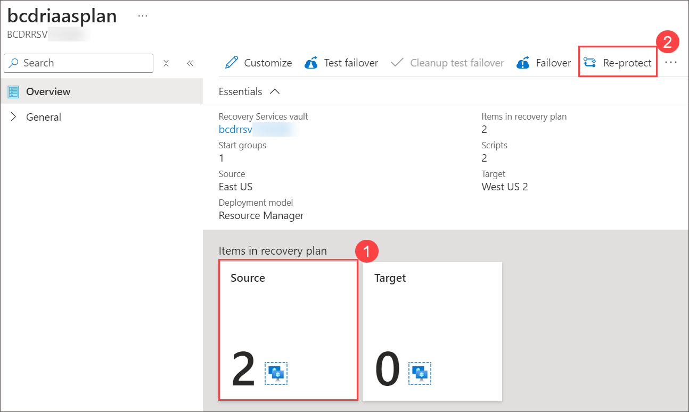

    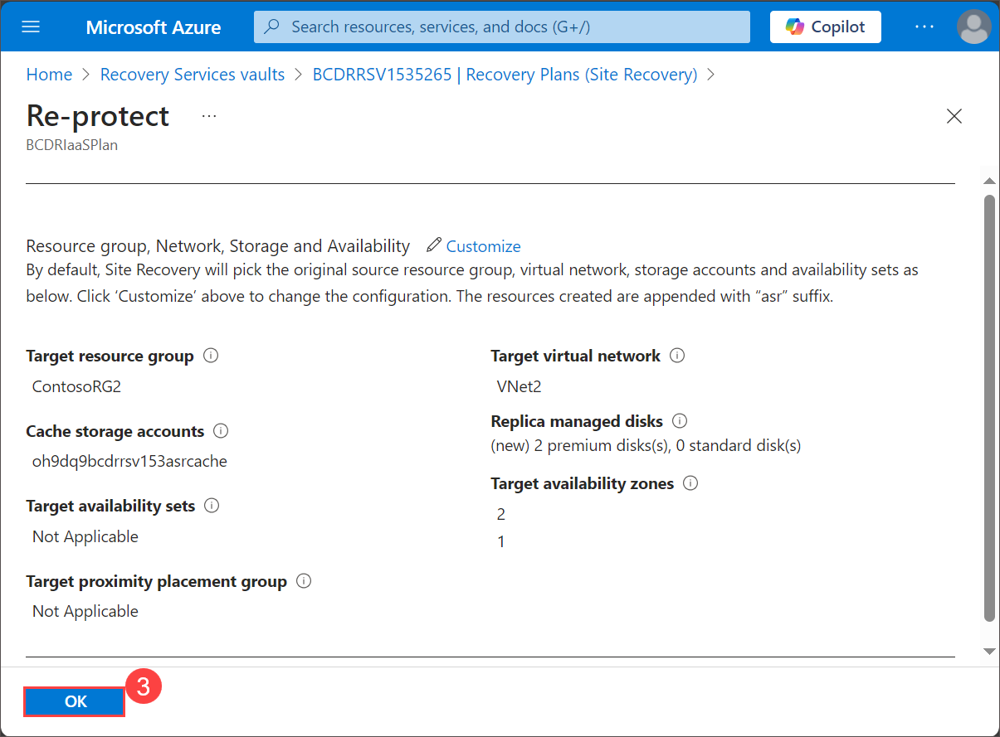

1.  As previously, the portal will submit a deployment. This process will take some time. You can proceed with the lab without waiting.

1.  Next, you need to reset the SQL Always On Availability Group environment to ensure a proper failover. Use Azure Bastion to connect to **SQLVM1** with username `demouser@contoso.com` and password `Demo!pass123`.

1. Once connected to **SQLVM1** open SQL Server Management Studio and Connect to **SQLVM1**. Expand the **Always On Availability Group**s and then right-click on **BCDRAOG** and then select **Show Dashboard**.

1. Notice that all the Replica partners are now Synchronous Commit with Automatic Failover Mode. You need to manually reset **SQLVM3** to be **Asynchronous** with **Manual Failover**.

    

1. Right-click the **BCDRAOG** and select **Properties**.

    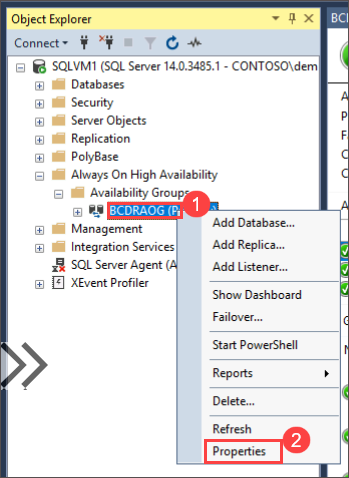

1. Change **SQLVM3** to **Asynchronous** and **Manual Failover** and select **OK**.

    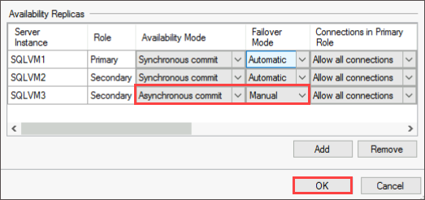

1. Show the Availability Group Dashboard again. Notice that they change has been made and that the AOG is now reset.

    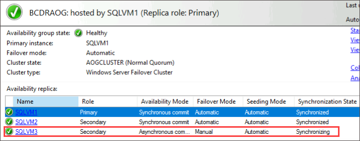

    > **Note:** This task could have been done using the Azure Automation script during Failback, but most DBAs would prefer a clean failback and then do this manually once they are comfortable with the failback.

### Task 4: Validate VM Backup

In this task, you will validate the backup for the Contoso application WebVMs. You will do this by removing several image files from **WebVM1**, breaking the Contoso application. You will then restore the VM from backup. 

1.  From the Azure portal, search and select virtual machine and stop **WebVM2** when prompted click on **Yes**. This forces all traffic to be served by **WebVM1**, which making the backup/restore verification easier.

      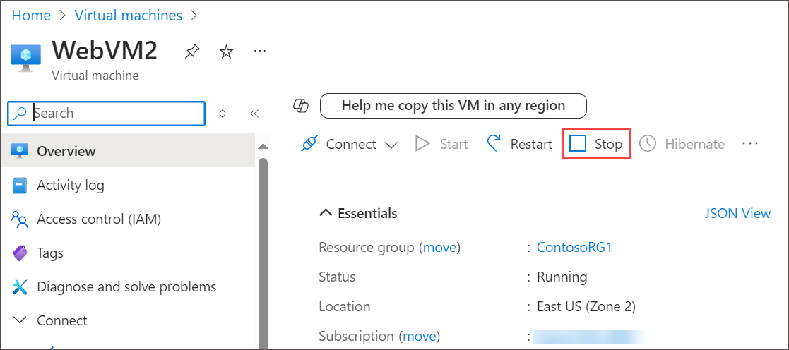

1.  Navigate to **WebVM1** and connect to the VM using Azure Bastion, using username `demouser@contoso.com` and password `Demo!pass123`.

1.  Open Windows Explorer and navigate to the `C:\inetpub\wwwroot\Content` folder. Select the three `.PNG` files and delete them.

    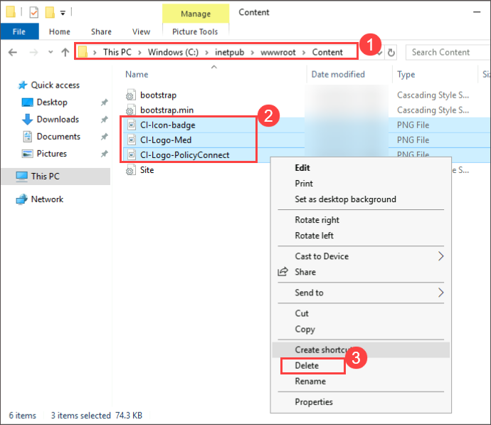

1.  In the Azure portal, locate the **ContosoWebLBPrimaryIP** public IP address in **ContosoRG1**. Copy the DNS name and open it in a new browser tab. Hold down `CTRL` and refresh the browser, to reload the page without using your local browser cache. The Contoso application should be shown with images missing.

    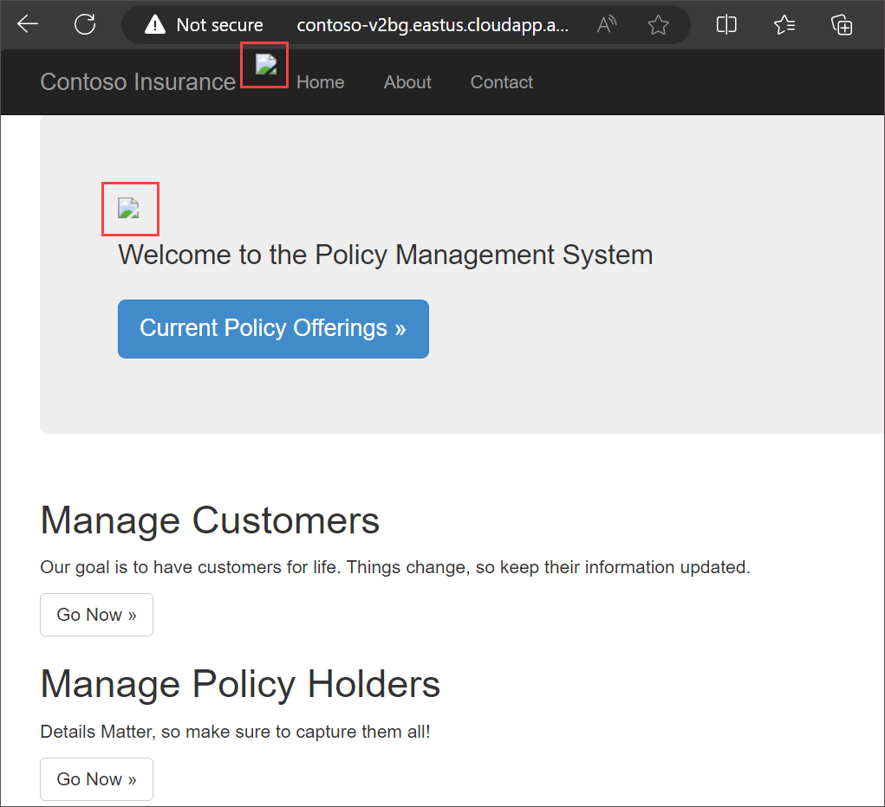

    >**Note**: If you prompted with doesn't support a secure connection please select **Continue to site**.

    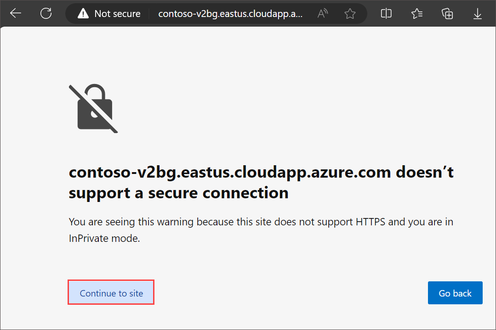

1.  To restore WebVM1 from backup, Azure Backup requires that a 'staging' storage account be available. To create this account, in the Azure portal select **+ Create a resource**, then search for and select **Storage account**. Select **Create**.

1.  Complete the 'Create storage account' form as follows, then select **Review** followed by **Create**.

    -   **Resource group:** ContosoRG1
    -   **Storage account name:** backupstaging<inject key="DeploymentID" enableCopy="false"/>
    -   **Location:** <inject key="Region" enableCopy="false" /> *(this is your primary region)*
    -   **Performance:** Standard
    -   **Replication:** Locally-redundant storage (LRS)

    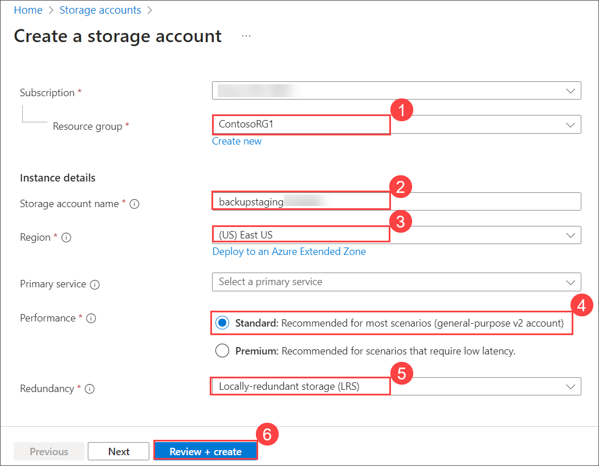

1.  Before restoring a VM, the existing VM must be shut down. Use the Azure portal to shut down **WebVM1**.

    > **Note:** since WebVM2 is also shut down, this will break the Contoso application. In a real-world scenario, you would keep WebVM2 running while restoring WebVM1.

1.  In the Azure portal, navigate to the **BackupRSV<inject key="DeploymentID" enableCopy="false"/>** Recovery Services Vault. Under 'Protected Items', select **Backup items**, then select **Azure Virtual Machine**.

    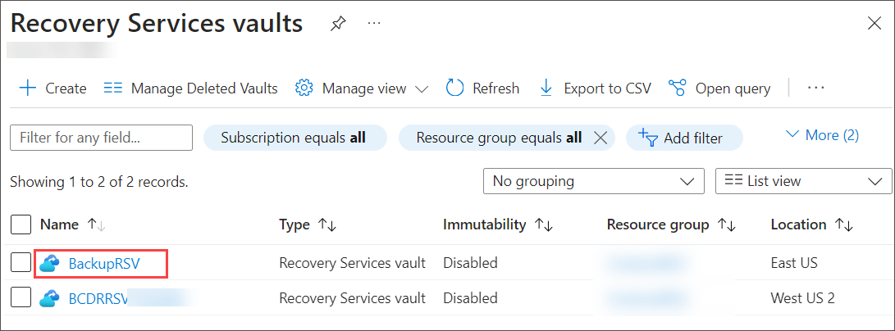

    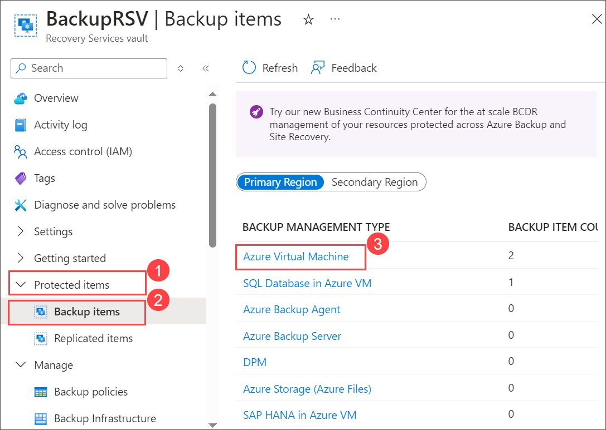

1.  On the Backup items page, select **View details** for **WebVM1**. On the **WebVM1** page, select **RestoreVM**.

     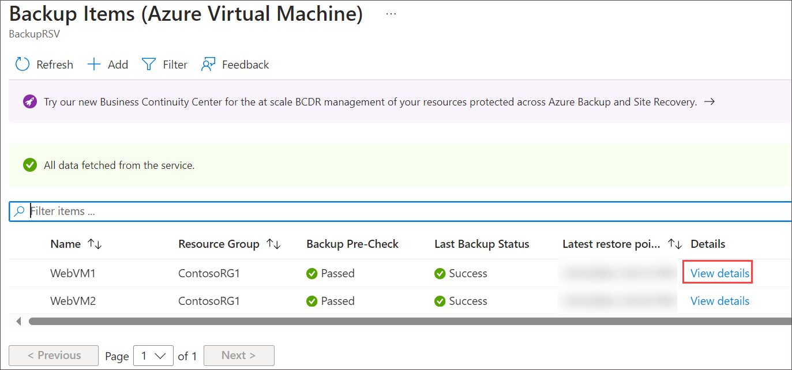

     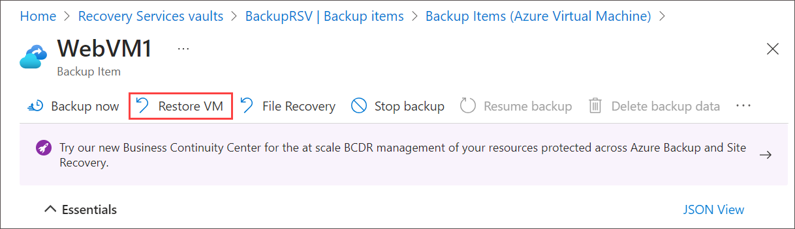

1. Complete the Restore Virtual Machine page as follows, then select **Restore (6)**.

    -   **Restore point:** Click on **Select (1)** link then select the most recent restore point **(2)** and click on **OK (3)**.
    -   **Restore Configuration:** Replace existing **(4)**
    -   **Staging Location**: Choose the storage account you created earlier, starting with backupstaging<inject key="DeploymentID" enableCopy="false"/> **(5)**.

        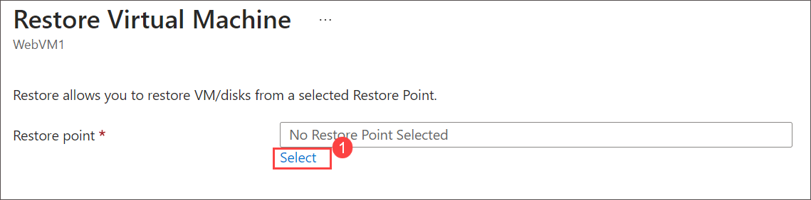

        

        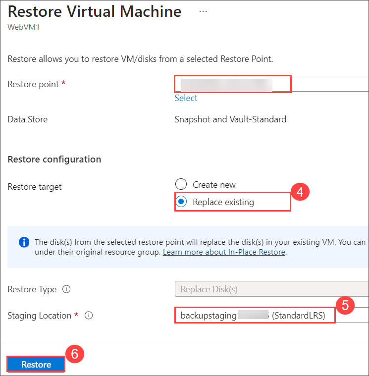
        
1. In the **BackupRSV<inject key="DeploymentID" enableCopy="false"/>** vault, navigate to the **Backup Jobs** view. Note that two new jobs are shown as 'In progress', one to take a backup of the VM and a second to restore the VM.

    

1. It will take several minutes for the VM to be restored. Wait for the restore to complete before proceeding with the lab.

1. Once the restore operation is complete, navigate to the **WebVM1** blade in the Azure portal, and **Start** the VM.

1. Wait for the VM to start, then return to your browser tab showing the Contoso application with missing images. Hold down `CTRL` and select **Refresh** to reload the page. The application is displayed with the images restored, showing the restore from backup has been successful. (As an optional step, you can also open a Bastion connection to the VM and check the deleted .PNG files have been restored.)

     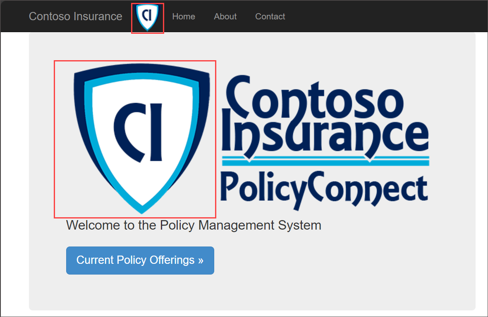

1. Start **WebVM2**.

### Task 5: Validate SQL Backup

In this task, you will validate the ability to restore the Contoso application database from Azure Backup.

1.  In the Azure portal, navigate to the **BackupRSV<inject key="DeploymentID" enableCopy="false"/>** in **ContosoRG1**. Under 'Protected items', select **Backup items**, then select **SQL in Azure VM**.

    

1.  From the backup items list, select **View details** for the **contosoinsurance** database.

      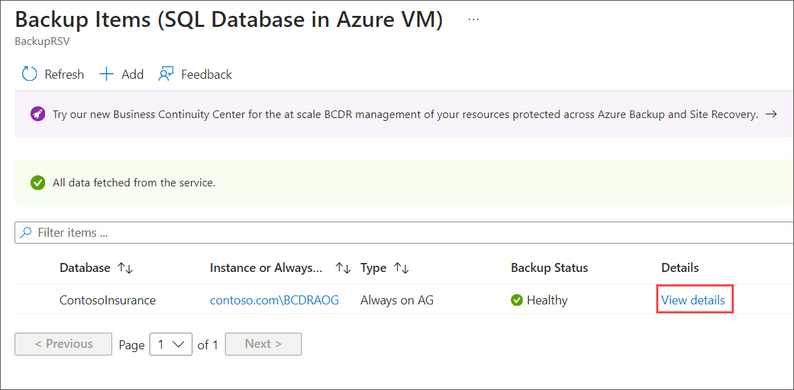

1.  From the **contosoinsurance** blade, select **Restore**.
    
    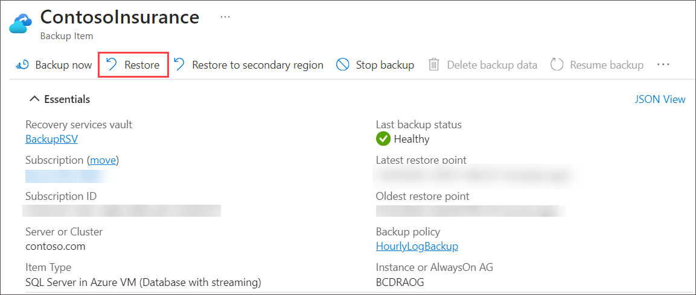

1.  Review the default settings on the **Restore** blade. By default, the backup will be restored to a new database alongside the existing database on SQLVM1.

     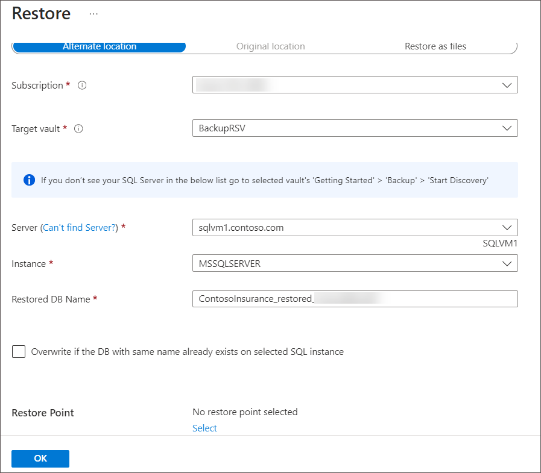

    > **Note:** For an Always On Availability Group backup, the option to overwrite the existing database is not available. You must restore to a parallel location.

1.  Select the option to choose your Restore Point. On the 'Select restore point' blade, explore the restore options. Note how the log-based option offers a point-in-time restore, whereas the full & differential option provides backup based on the backup schedule.

    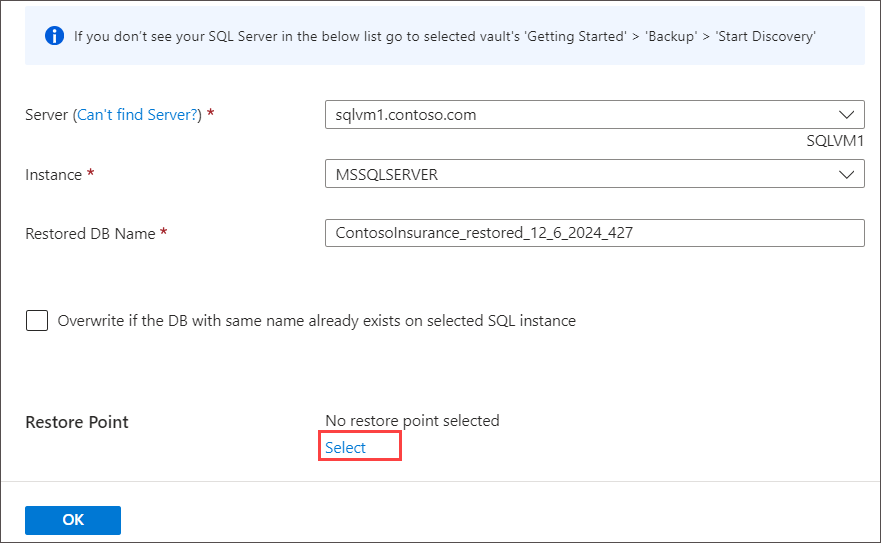

    Choose any restore point and select **OK**.

    

    

1.  Under 'Advanced Configuration', select **Configure**. Review the settings but don't change anything. Select **OK** to accept the default configuration

      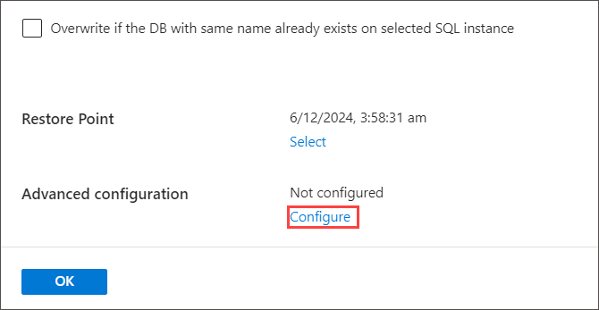

1.  Select **OK** to start the restore process.
   
1.  Navigate to the **Backup Jobs** view. The ContosoInsurance job is 'In progress'. Use the **Refresh** button to monitor the progress and wait for the job to complete.

     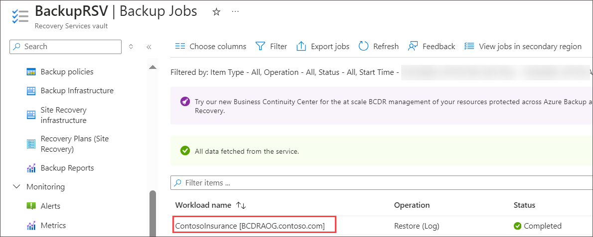

1.  Navigate to **SQLVM1** and connect to the VM using Azure Bastion, using username `demouser@contoso.com` and password `Demo!pass123`.

1. On SQLVM1, open **SQL Server Management Studio** and connect to SQLVM1.

1. Note that the restored database is present on the server alongside the production database.

    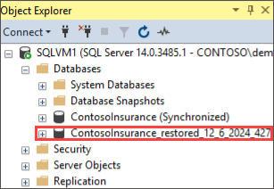

    > **Note:** You can now either copy data from the restored database to the production database, or add this database to the Always On Availability Group and switch the Web tier to use the restored database.
   
> **Congratulations** on completing the task! Now, it's time to validate it. Here are the steps:
> - Hit the Validate button for the corresponding task. If you receive a success message, you can proceed to the next task. 
> - If not, carefully read the error message and retry the step, following the instructions in the lab guide.
> - If you need any assistance, please contact us at cloudlabs-support@spektrasystems.com. We are available 24/7 to help
<validation step="a1948261-3fef-4f42-8f0c-051afcdfb6d5" />

## Summary 

In this exercise, you validated high availability and disaster recovery by performing failover and failback between IaaS regions. Additionally, VM and SQL backups were validated to ensure the integrity and recoverability of critical resources.

### You have successfully completed the lab
